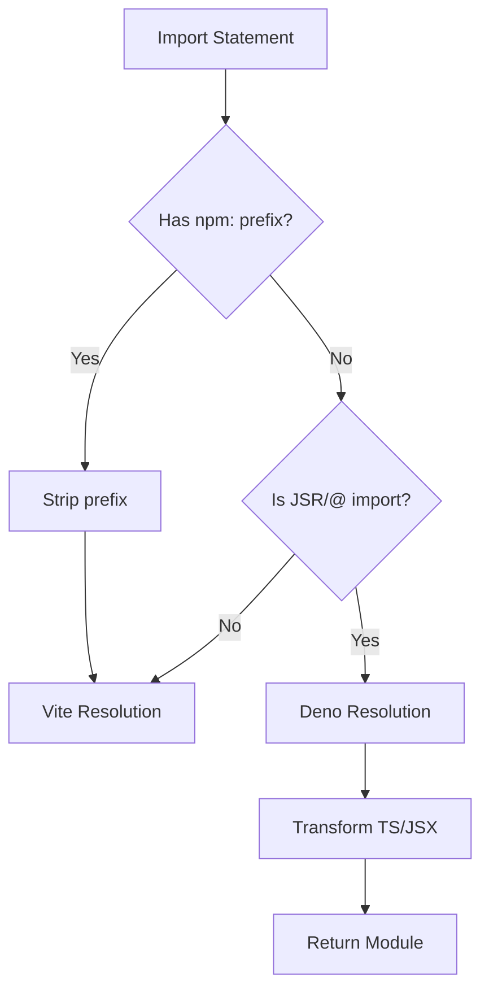

# RFC-00: Initial Design for Deno Vite Plugin

**Status:** Draft  
**Author:** [To be filled]  
**Created:** 2025-01-23  
**Discussion:** [Link to discussion]

## Summary

This RFC outlines the initial design for a comprehensive Vite plugin that enables seamless integration with Deno 2's runtime features, including support for JSR imports, NPM specifiers, import maps, and full SSR capabilities.

## Motivation

Deno 2 introduces powerful features like JSR (JavaScript Registry) imports and improved NPM compatibility. However, Vite doesn't natively understand these Deno-specific import specifiers. This plugin bridges that gap, enabling developers to use Vite's excellent build tooling while leveraging Deno's modern runtime capabilities.

## Detailed Design

### Core Architecture

The plugin system consists of multiple specialized plugins that work together:

```typescript
export function denoVite(options?: DenoViteOptions): Plugin[] {
  return [
    npmUnprefixPlugin(),
    denoResolverPlugin(options),
    ssrDevPlugin(options),
    // Additional plugins as needed
  ]
}
```

### Plugin Responsibilities

#### 1. NPM Unprefix Plugin
- **Purpose:** Strip `npm:` prefixes from imports
- **Order:** Must run first to normalize imports
- **Example:** `npm:react@18` → `react`

#### 2. Deno Resolver Plugin
- **Purpose:** Resolve JSR and Deno-specific imports
- **Handles:**
  - `jsr:@std/path`
  - `@organization/package` (configurable)
  - Import map resolution
- **Implementation:** Uses `deno info --json` for accurate resolution

#### 3. SSR Dev Plugin
- **Purpose:** Enable native Deno module loading during SSR development
- **Features:**
  - Selective externalization
  - Native dynamic imports
  - Global module storage

### Import Resolution Strategy



### Configuration Options

```typescript
interface DenoViteOptions {
  // Import map configuration
  importMap?: string | ImportMap
  
  // SSR externalization
  ssr?: {
    // Packages to load natively in dev
    external?: string[]
    // Bundle everything in production
    noExternal?: boolean | string[]
  }
  
  // Resolution options
  resolve?: {
    // Additional prefixes to handle
    prefixes?: string[]
    // Cache TTL in milliseconds
    cacheTTL?: number
  }
}
```

### Import Map Support

The plugin will support multiple import map sources:

1. **Automatic Detection:**
   - `deno.json` / `deno.jsonc`
   - `import_map.json`
   - CLI specified maps

2. **Explicit Configuration:**
   ```typescript
   denoVite({
     importMap: './custom-import-map.json'
   })
   ```

3. **Programmatic Maps:**
   ```typescript
   denoVite({
     importMap: {
       imports: {
         'react': 'npm:react@18'
       }
     }
   })
   ```

### SSR Strategy

#### Development Mode
- Use native Deno imports for specified dependencies
- Bypass bundling for faster iteration
- Maintain module state in globalThis

#### Production Mode
- Support multiple strategies:
  1. **Full Bundle:** Everything included
  2. **Full External:** All dependencies external
  3. **Selective:** Configure per-dependency

### Caching Strategy

1. **Resolution Cache:**
   - In-memory cache for `deno info` results
   - Configurable TTL
   - Invalidation on file changes

2. **Transform Cache:**
   - Leverage Vite's built-in caching
   - Cache transformed TS/JSX output

### Error Handling

1. **Clear Error Messages:**
   ```
   Failed to resolve JSR import: jsr:@std/path
   Reason: Package not found in registry
   Suggestion: Run 'deno add jsr:@std/path'
   ```

2. **Fallback Strategies:**
   - Graceful degradation for missing imports
   - Development-time warnings
   - Production build failures

## Implementation Plan

### Phase 1: Core Functionality (Current)
- ✅ Basic JSR resolution
- ✅ NPM prefix stripping
- ✅ SSR dev mode support
- ✅ TypeScript transformation

### Phase 2: Import Maps (Next)
- [ ] Import map file detection
- [ ] Import map parsing and merging
- [ ] Resolution with import maps
- [ ] Import map validation

### Phase 3: Advanced SSR
- [ ] Configurable externalization strategies
- [ ] Production SSR optimization
- [ ] Edge runtime support

### Phase 4: Developer Experience
- [ ] HMR support
- [ ] Better error messages
- [ ] Performance profiling
- [ ] Debug mode

## Alternatives Considered

### 1. Single Monolithic Plugin
- **Pros:** Simpler API
- **Cons:** Less flexible, harder to maintain

### 2. Deno-Native Build Tool
- **Pros:** Perfect Deno integration
- **Cons:** Lose Vite ecosystem benefits

### 3. Compile-Time Import Rewriting
- **Pros:** No runtime overhead
- **Cons:** Complex implementation, source map issues

## Open Questions

1. **Import Map Priority:** How should multiple import maps be merged?
2. **Cache Persistence:** Should resolution cache persist between builds?
3. **HMR Boundary:** How to handle HMR across Deno/Node boundary?
4. **Performance Goals:** What's acceptable resolution overhead?
5. **Edge Cases:** How to handle circular dependencies through JSR?

## Security Considerations

1. **Resolution Validation:** Ensure resolved paths are safe
2. **Import Map Sanitization:** Validate untrusted import maps
3. **SSR Module Isolation:** Prevent global pollution

## Testing Strategy

See RFC-01 for comprehensive testing approach.

## Migration Path

For existing Vite + Deno projects:

1. Install plugin: `deno add @pea2/deno-vite-plus`
2. Add to vite.config.ts:
   ```typescript
   import { denoVite } from '@pea2/deno-vite-plus'
   
   export default {
     plugins: [denoVite()]
   }
   ```
3. Gradually adopt Deno-specific imports

## References

- [Vite Plugin API](https://vitejs.dev/guide/api-plugin.html)
- [Deno Module Resolution](https://deno.land/manual/basics/modules)
- [JSR Documentation](https://jsr.io/docs)
- [Import Maps Specification](https://github.com/WICG/import-maps)