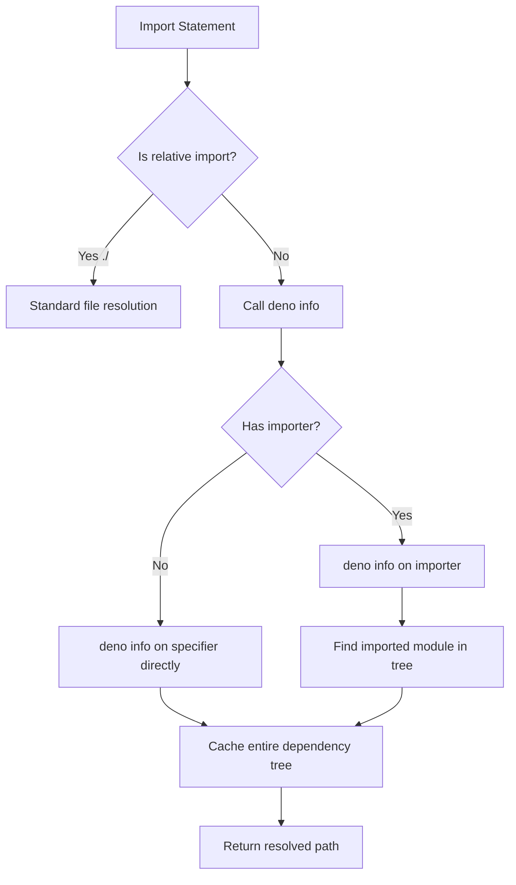

# RFC-00: Initial Design for Deno Vite Plugin

**Status:** Draft  
**Author:** [To be filled]  
**Created:** 2025-01-23  
**Updated:** 2025-01-23
**Discussion:** [Link to discussion]

## Summary

This RFC outlines the design for a unified Vite plugin that enables seamless integration with Deno 2's runtime features. The plugin leverages `deno info` for all non-relative imports to ensure proper package resolution and auto-installation, while providing flexible SSR strategies for both development and production builds.

## Motivation

Deno 2 introduces powerful features like JSR (JavaScript Registry) imports and improved NPM compatibility. However, Vite doesn't natively understand these Deno-specific import specifiers. This plugin bridges that gap by using Deno's native resolution capabilities while maintaining Vite's excellent build tooling benefits.

## Detailed Design

### Core Architecture

The plugin is designed as a single, unified plugin that handles all aspects of Deno integration:

```typescript
export function denoVite(options?: DenoViteOptions): Plugin {
  return {
    name: 'vite:deno',
    // All resolution, transformation, and SSR logic in one plugin
  }
}
```

### Resolution Strategy

#### Universal `deno info` Usage
- **All non-relative imports** (not starting with `./` or `../`) are resolved via `deno info`
- This ensures:
  - Automatic package installation (e.g., `npm:react` gets installed on first use)
  - Accurate resolution following Deno's rules
  - Import map support out of the box

#### Package Root Detection
The plugin determines the package root by:
1. Starting from the current file's directory
2. Walking up the directory tree to find the closest `deno.json` or `deno.jsonc`
3. Alternatively, accepting a user-specified root via configuration

This package root is crucial for determining internal vs external modules.

### Resolution Flow



### Caching Strategy

The plugin implements aggressive caching to minimize `deno info` calls:

1. **Dependency Tree Caching:**
   - When resolving module A that imports B which imports C
   - Single `deno info` call captures entire tree
   - Cache stores: A→B, B→C relationships
   - Subsequent resolution of C from B uses cache

2. **Cache Structure:**
   ```typescript
   interface ModuleCache {
     // Module path -> DenoInfo result
     modules: Map<string, DenoInfoModule>
     // Importer -> Imported -> Resolved path
     resolutions: Map<string, Map<string, string>>
     // Dependency trees
     trees: Map<string, DependencyTree>
   }
   ```

### SSR Strategy

#### Development Mode
- Continue using virtual module approach
- All imports resolved through Deno's native module loading
- Maintain compatibility with HMR

#### Production Mode

Two configurable strategies:

1. **External Everything (Default):**
   - All dependencies are external by default
   - `nonExternal` list for exceptions
   - Minimal bundle size

2. **External Nothing:**
   - Bundle all dependencies by default
   - `external` list for exceptions
   - Self-contained bundles

**Key Innovation:** Unlike Vite's pattern-based externalization, we use specifiers:
```typescript
// Instead of patterns
external: ['react', /^@mui/]

// We use specifiers that get resolved
external: ['react', '@mui/material']
// Plugin resolves these via deno info and externalizes entire dependency trees
```

### Configuration Options

```typescript
interface DenoViteOptions {
  // Package root configuration
  packageRoot?: string // Path to deno.json, defaults to auto-detection
  
  // SSR configuration
  ssr?: {
    // Production externalization strategy
    mode?: 'external-everything' | 'external-nothing' // default: 'external-everything'
    
    // For 'external-everything' mode
    nonExternal?: string[] // Specifiers to bundle
    
    // For 'external-nothing' mode  
    external?: string[] // Specifiers to externalize
  }
  
  // Resolution options
  resolve?: {
    // Cache configuration
    cache?: {
      // Whether to persist cache between runs
      persistent?: boolean
      // Cache directory (for persistent cache)
      directory?: string
    }
  }
  
  // Testing/Development
  testing?: {
    // Temp directory for deno info calls during tests
    tempDir?: string
  }
}
```

### Import Map Support

Import maps are automatically supported through `deno info`:
- The plugin doesn't need to parse import maps directly
- Deno handles all import map resolution internally
- Works with deno.json, import_map.json, or CLI-specified maps

### Internal vs External Module Detection

The plugin determines if a module is internal or external based on package boundaries:

1. **Internal modules:**
   - Located within the same package root (contains deno.json)
   - Relative imports

2. **External modules:**
   - NPM packages (`npm:*`)
   - JSR packages (`jsr:*`)
   - Modules outside the package root
   - Bare specifiers resolved to node_modules

### Implementation Details

#### Resolution Algorithm
```typescript
async function resolveId(id: string, importer?: string) {
  // Skip relative imports
  if (id.startsWith('./') || id.startsWith('../')) {
    return null // Let Vite handle
  }
  
  // Check cache first
  if (cache.has(importer, id)) {
    return cache.get(importer, id)
  }
  
  // Call deno info
  const target = importer || id
  const info = await denoInfo(target)
  
  // Cache entire dependency tree
  cacheTree(info)
  
  // Find and return resolved path
  return findInTree(info, id)
}
```

#### Module Type Detection
Use deno info JSON output to identify module types:
```typescript
interface DenoInfoModule {
  kind: 'npm' | 'esm' | 'node' | 'file'
  specifier: string
  local?: string
  npmPackage?: string // Present for npm: modules
  mediaType?: string
  dependencies?: Array<{
    specifier: string
    code?: { specifier: string }
    type?: { specifier: string }
  }>
}

function isNpmPackage(module: DenoInfoModule): boolean {
  return module.kind === 'npm'
}
```

## Implementation Plan

### API Design

```typescript
// Main plugin export
export function denoVite(options?: DenoViteOptions): Plugin

// Usage
export default defineConfig({
  plugins: [denoVite({
    packageRoot: './path/to/deno.json',
    ssr: {
      mode: 'external-everything',
      nonExternal: ['my-internal-lib']
    }
  })]
})
```

### Code Structure

```
deno-vite-plus/
├── index.ts              # Main plugin export
├── lib/
│   ├── cache.ts         # Caching implementation
│   ├── deno-info.ts     # Deno info wrapper & parser
│   ├── resolver.ts      # Core resolution logic
│   ├── package-root.ts  # Package root detection
│   ├── ssr.ts          # SSR-specific logic
│   └── transform.ts     # Code transformation
└── tests/
    ├── unit/
    │   ├── cache.test.ts
    │   ├── resolver.test.ts
    │   └── ssr.test.ts
    └── integration/
        └── plugin.test.ts
```

### Core Components

#### 1. Deno Info Wrapper (`lib/deno-info.ts`)
```typescript
export interface DenoInfoResult {
  version: number
  roots: string[]
  modules: DenoInfoModule[]
  redirects: Record<string, string>
  packages?: Record<string, string>
  npmPackages?: Record<string, NpmPackageInfo>
}

export async function denoInfo(specifier: string, options?: {
  cwd?: string
  importMap?: string
}): Promise<DenoInfoResult>

export function parseDenoInfo(output: string): DenoInfoResult
```

#### 2. Cache System (`lib/cache.ts`)
```typescript
export class DenoInfoCache {
  // Module resolution cache
  private modules = new Map<string, DenoInfoModule>()
  
  // Importer -> imported -> resolved
  private resolutions = new Map<string, Map<string, string>>()
  
  // Full dependency trees
  private trees = new Map<string, DenoInfoResult>()
  
  async resolve(specifier: string, importer?: string): Promise<string>
  cacheTree(info: DenoInfoResult): void
  clear(): void
}
```

#### 3. Package Root Detection (`lib/package-root.ts`)
```typescript
export async function findPackageRoot(startDir: string): Promise<string | null>
export function isInternalModule(
  modulePath: string, 
  packageRoot: string
): boolean
```

#### 4. SSR Externalization (`lib/ssr.ts`)
```typescript
export interface SsrExternalizer {
  isExternal(id: string, importer?: string): boolean
  resolveExternal(specifier: string): Promise<Set<string>>
}

export function createSsrExternalizer(
  options: DenoViteOptions['ssr'],
  cache: DenoInfoCache
): SsrExternalizer
```

### Testing Strategy

#### Unit Tests
1. **Cache behavior**: Test caching, invalidation, and tree storage
2. **Resolution logic**: Mock deno info responses for various scenarios
3. **SSR externalization**: Test both modes with different configurations
4. **Package root detection**: Test walking up directory tree

#### Integration Tests
1. **Real deno info calls**: Use temp directories with fixtures
2. **Build scenarios**: Test dev/prod builds with various imports
3. **Error cases**: Missing packages, circular dependencies

#### Mocking Strategy
```typescript
// Mock deno info for unit tests
export function mockDenoInfo(responses: Map<string, DenoInfoResult>) {
  return async (specifier: string) => {
    return responses.get(specifier) || throw new Error('Not found')
  }
}
```

### Testing Infrastructure

#### Temp Directory System
```typescript
// test-utils.ts
export async function withTempDir<T>(
  fn: (dir: string) => Promise<T>
): Promise<T> {
  const dir = await Deno.makeTempDir()
  try {
    return await fn(dir)
  } finally {
    await Deno.remove(dir, { recursive: true })
  }
}

// Usage in tests
await withTempDir(async (dir) => {
  // Copy fixtures
  await copyFixtures('basic-app', dir)
  
  // Run deno info
  const info = await denoInfo('npm:react', { cwd: dir })
  
  // Assert results
})
```

#### Environment Configuration
```typescript
// For development, use env var or config file
const testConfig = {
  tempDir: Deno.env.get('DENO_VITE_TEST_DIR') || 
           await readConfig('.test-config.json')?.tempDir ||
           await Deno.makeTempDir()
}
```

### Phase-by-Phase Implementation

#### Phase 1: Unified Plugin Structure (Immediate)
1. Merge existing plugins into single plugin
2. Implement deno info wrapper
3. Basic caching system
4. Package root detection

#### Phase 2: Enhanced Resolution (Week 1-2)
1. Full dependency tree caching
2. Proper npm: handling via deno info
3. SSR externalization logic
4. Testing infrastructure

#### Phase 3: Production Optimization (Week 3-4)
1. Persistent cache option
2. Advanced SSR strategies
3. Performance profiling
4. Error handling improvements

#### Phase 4: Polish (Week 5+)
1. Comprehensive documentation
2. Migration guide from multi-plugin
3. Performance benchmarks
4. Edge case handling

## Alternatives Considered

### 1. Continue with Multiple Plugins
- **Pros:** Already implemented, separation of concerns
- **Cons:** Complex configuration, plugin ordering issues

### 2. AST-based Import Rewriting
- **Pros:** No subprocess calls
- **Cons:** Reimplementing Deno's resolution logic

### 3. Deno Subcommand Integration
- **Pros:** Perfect compatibility
- **Cons:** Requires Deno runtime modifications

## Open Questions

1. **Cache Persistence Format:** JSON, MessagePack, or custom binary?
2. **Parallel Resolution:** How many concurrent deno info calls?
3. **Memory Limits:** When to evict cache entries?
4. **Config Migration:** Auto-migrate from old multi-plugin setup?

## Security Considerations

1. **Temp Directory Access:** Ensure isolated test environments
2. **Cache Poisoning:** Validate deno info output
3. **Path Traversal:** Sanitize resolved paths

## Migration Path

From current multi-plugin setup:

```typescript
// Before
import { denoVitePlus } from '@pea2/deno-vite-plus'

export default {
  plugins: denoVitePlus({
    nodePrefix: '@org/',
    css: true
  })
}

// After
import { denoVite } from '@pea2/deno-vite-plus'

export default {
  plugins: [denoVite({
    // Simplified, unified configuration
  })]
}
```

## References

- [Vite Plugin API](https://vitejs.dev/guide/api-plugin.html)
- [Deno Module Resolution](https://deno.land/manual/basics/modules)
- [JSR Documentation](https://jsr.io/docs)
- [Import Maps Specification](https://github.com/WICG/import-maps)